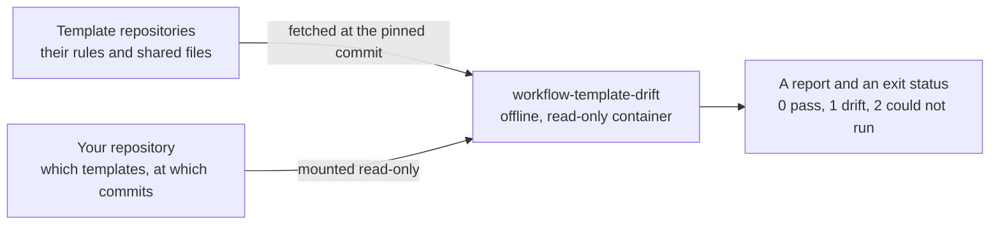

# workflow-template-drift

[](https://github.com/nwarila-platform/workflow-template-drift/actions/workflows/ci.yaml)

A small container that answers one question on every pull request: **has this repository drifted
from the templates it is supposed to follow?**

It compares the repository with pinned copies of its templates, prints a report, and exits. That is
all it does. It never edits a file, it never opens a network connection, and it depends on nothing
but the Python standard library.

## Why it exists

An organization keeps its shared files (CI workflows, security policies, linter settings, decision
records) in template repositories and copies them into every project. Copies drift. Someone edits
one, or the template moves on, and nobody notices until the difference matters. This check makes
drift visible where it is cheapest to fix: in the pull request that introduces it.

A plain `diff` cannot do the job, because the rules are not all "identical". Some files must match
exactly, some only in their first lines, some must merely exist, and some must not exist at all.



## See it work

The repository carries a miniature template and a miniature repository that has drifted from it.
With Python 3.12 and nothing installed, run:

```sh
python3 -m workflow_template_drift \
  --workspace example/repository \
  --template example/template=example/template
```

```text
warning: SECURITY.md: must_exist/target_missing (template example/template): target is missing
error: legacy.cfg: must_be_absent/target_present (template example/template): target must be absent
error: lint.toml: bytes_equal/content_mismatch (template example/template): target content differs from the pinned template
template-drift: FAIL (1 template, 5 checks, 2 errors, 1 warning)
```

The template declares five checks. Two pass and are not mentioned: `CHANGELOG.md` exists, and
`pipeline.yaml` still starts with the template's four lines, although the repository added a stage
of its own below them. The other three each get one line, and the command exits with status 1.

## The four checks

A template repository lists its rules in a file named `template-drift.json` at its root. This is
the example's, [`example/template/template-drift.json`](example/template/template-drift.json):

```json
{
  "version": 3,
  "checks": [
    {"mode": "bytes_equal", "path": "lint.toml"},
    {"mode": "head_lines_equal", "path": "pipeline.yaml", "head_lines": 4},
    {"mode": "must_exist", "path": "CHANGELOG.md"},
    {"mode": "must_exist", "path": "SECURITY.md", "severity": "warning"},
    {"mode": "must_be_absent", "path": "legacy.cfg"}
  ]
}
```

| Mode | The repository passes when | Use it for |
| --- | --- | --- |
| `bytes_equal` | the file is byte-for-byte identical to the template's copy | a file nobody should change locally |
| `head_lines_equal` | the file's first `head_lines` lines are identical to the template's | a file with a fixed top that each repository extends below |
| `must_exist` | a file exists at the path | a file every repository needs but writes for itself |
| `must_be_absent` | nothing exists at the path | a retired file that must not come back |

- `path` names the same path in the template and in the repository. The two comparing modes also
  accept `source` (the path in the template) with `target` (the path in the repository), for when
  the two differ.
- `severity` is `error` unless it is set to `warning`. A warning is reported but does not fail the
  check, which lets a template announce a rule before it enforces it.
- A repository may follow several templates, but each path may be governed by only one of them.

## The report

The report has one line for each broken rule, sorted by path, and then one summary line:

```text
<severity>: <path>: <mode>/<problem> (template <owner/repo>): <explanation>
template-drift: <PASS, WARNING or FAIL> (<n> templates, <n> checks, <n> errors, <n> warnings)
```

| Problem | Meaning |
| --- | --- |
| `target_missing` | nothing exists at the path |
| `target_not_regular` | something exists at the path, but it is not a regular file: a directory or a symbolic link, for example |
| `content_mismatch` | the file, or its first lines, differs from the template's |
| `target_present` | something exists at a path that must be empty |

| Exit status | Meaning |
| --- | --- |
| `0` | The repository passes. Any warnings are still listed. |
| `1` | The repository has drifted: at least one error, or any finding with `--fail-on warning`. |
| `2` | The check could not be carried out: wrong arguments, a malformed manifest, a file that must be compared but cannot be read, or a report that could not be written in full. This is never reported as drift, and anything already on standard output is incomplete and must be ignored. |

## Using it in a repository

A repository that follows templates carries two small files and one workflow job.

`.github/.config/template-drift.yaml` names the templates. An entry without an owner, such as
`.github`, means a repository in the same organization:

```yaml
templates:
  - .github
  - NWarila/terraform-framework-template
```

`.github/.config/template-drift.lock` pins each template to one commit. Adopting a newer version of
a template is a one-line change here, and the report on that pull request lists every file that has
to follow:

```text
nwarila-platform/.github 0188f9cc9d325aaa1d173286da9a2ba99210b09c
NWarila/terraform-framework-template <40-character commit>
```

The workflow job calls [`check.yaml`](.github/workflows/check.yaml) in this repository, pinned to a
commit, and says which release of the container to run:

```yaml
jobs:
  template-drift:
    permissions: {contents: read, security-events: write}
    uses: nwarila-platform/workflow-template-drift/.github/workflows/check.yaml@<40-character commit>
    with:
      version: <version>
      digest: sha256:<digest of that version's image>
```

`check.yaml` hands the job to the organization's runner workflow, which does everything that needs
the network so that the container needs none:

1. It verifies the image's signature and confirms that the image is the pinned digest.
2. On a pull request it reads the list of templates from the base branch, so a pull request cannot
   remove a template from its own check.
3. It fetches each template at its pinned commit, then confirms that the commit belongs to the
   template's default branch and, on a pull request, that the pin has not moved backwards.
4. It runs the container with no network, a read-only filesystem and no capabilities, with the
   repository and the templates mounted read-only.

To run the same check before pushing, use [`tools/template-drift.sh`](tools/template-drift.sh),
which needs only Git and either Podman or Docker. It is also published as a
[pre-commit](https://pre-commit.com) hook:

```yaml
repos:
  - repo: https://github.com/nwarila-platform/workflow-template-drift
    rev: <40-character commit>
    hooks:
      - id: template-drift
```

The hook runs before each push, so install it with `pre-commit install --hook-type pre-push`.

## Why the result can be trusted

- **It only reports.** Nothing is patched, synchronized or repaired, so the check cannot damage the
  repository it inspects.
- **It runs offline and unprivileged.** The container has no network, no writable filesystem and no
  capabilities, and runs as an unprivileged user.
- **Its inputs are pinned.** Templates are pinned by commit, and the image is verified by signature
  and by digest before it runs.
- **A governed path never passes through a symbolic link.** A link at the path is always a
  finding, and a link above it stops the check, so a repository cannot satisfy a rule by pointing
  at a file kept somewhere else.
- **Manifests are read strictly.** Unknown keys and modes, repeated keys and paths that could
  leave the repository are refused instead of ignored, so a misspelt key or mode can never weaken
  a rule.
- **Status 1 means drift and nothing else.** Every failure of the check itself, even a report that
  cannot be written, exits with status 2.
- **There is no third-party code in it.** The checker is about 300 lines of standard-library Python.

## How a release is made

Pushing a signed tag `v<VERSION>` starts [`publish.yaml`](.github/workflows/publish.yaml). Its jobs
run in this order, and a release tag appears on the image only if every one of them succeeds:

| Job | What it does |
| --- | --- |
| Release and SLSA tag integrity | Confirms that the tag is annotated and signed, and that it points at the commit being built. |
| Publish unaliased candidate by digest | Confirms that the tag matches `VERSION`, builds the image for `amd64` and `arm64` with a software bill of materials, and pushes it by digest only, with no tag. |
| Sign candidate index and children | Signs the image with Sigstore keyless signing, tied to this workflow and this tag. |
| SLSA L3 provenance | Attaches build provenance from the SLSA GitHub generator. |
| Anonymous evidence and runtime verification | Logged out, as any consumer would be, checks the signatures, the provenance and the bills of materials, then runs [`tests/image.sh`](tests/image.sh) on each architecture's image. |
| Promote verified digest to consumer tags | Only now gives the image its version tag and a `sha-<commit>` tag. A tag is created once and never moved. |

There is no `latest` tag. Anyone can verify a release from a checkout of its tag:

```sh
version=$(cat VERSION)
cosign verify "ghcr.io/nwarila-platform/workflow-template-drift:$version" \
  --certificate-identity "https://github.com/nwarila-platform/workflow-template-drift/.github/workflows/publish.yaml@refs/tags/v$version" \
  --certificate-oidc-issuer https://token.actions.githubusercontent.com
```

## Working on it

```sh
bash tests/host.sh                                          # the unit tests; needs only Python 3.12
docker build --file Containerfile --tag template-drift:dev .
bash tests/image.sh template-drift:dev linux/amd64          # the example, through the built image
```

With Podman, build with `podman build` and set `CONTAINER_RUNTIME=podman` for the image tests.
[`ci.yaml`](.github/workflows/ci.yaml) runs both test scripts on every pull request and on every
push to `main`, building and testing the image on `amd64` and on `arm64`.

## What is in this repository

```text
workflow_template_drift/      the checker
  checker.py                  manifests, the four checks and the report
  __main__.py                 the command line and the exit statuses
  __init__.py                 marks the directory as a Python package
example/                      a template, a repository that has drifted from it, and the expected report
tests/
  test_checker.py             end-to-end tests of the command line
  host.sh                     runs the unit tests
  image.sh                    runs the example through a built image
tools/
  template-drift.sh           runs the check locally, the way CI runs it
  install-crane.sh            installs the registry client the release pipeline uses, by checksum
Containerfile                 the image: the base Python image plus the checker
VERSION                       the version the next release tag must match
.pre-commit-hooks.yaml        the pre-commit hook other repositories can use
.github/
  workflows/check.yaml        the workflow other repositories call
  workflows/ci.yaml           tests on every pull request, on both architectures
  workflows/publish.yaml      the release pipeline
  workflows/workflow-containers.yaml   this repository checking itself with its own latest release
  .config/                    the templates this repository follows, and their pinned commits
  renovate.json5              dependency update rules
  CODEOWNERS                  who reviews changes
docs/decision-records/org/    the organization's decision records, checked against their template
SECURITY.md                   how to report a vulnerability
LICENSE                       MIT
```

The remaining files (`.gitignore`, `.dockerignore`, `.editorconfig`, `.gitattributes`) configure
Git, the image build and editors. `.gitignore` is deny-by-default: a file is tracked only if it is
listed there by name.
